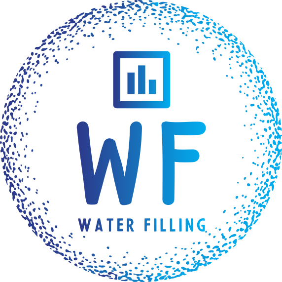

# Water Filling

This is a C++ command line app to optimize the water filling problem with plotting support.

## Installation
### Build
This project uses `cmake`.

## License
This project is licensed under the [MIT License](LICENSE).
